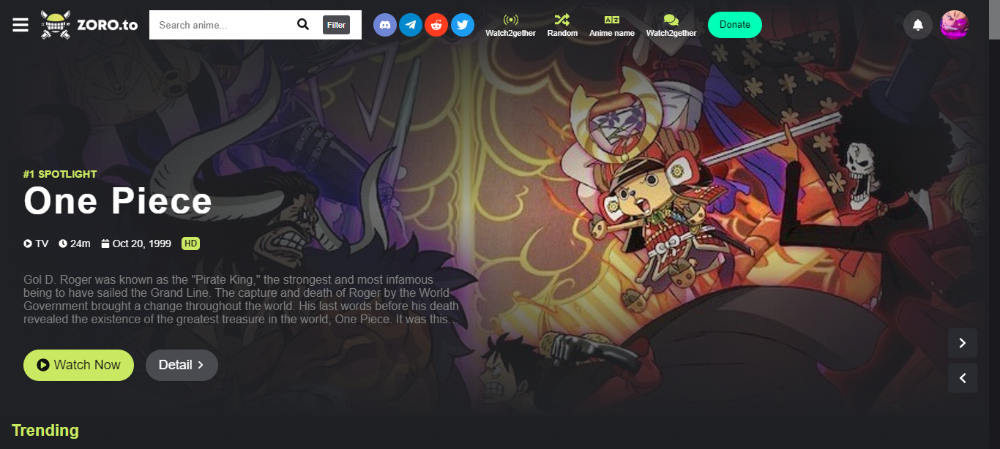

<p align="center">
<a href=https://github.com/fiskryeziu/zoroClone target="_blank">

</a>
</p>


<p align="center">


</p>

<p></p>
<p></p>

# 📌 Overview

ZoroClone: A ReactJS Anime Website Clone 🗡️📺 – Emulate the magic of aniwatch.to with this project, offering a replica of the popular anime streaming website.

## 🔍 Table of Contents

* [📁 Project Structure](#-project-structure)

* [📝 Project Summary](#-project-summary)

* [💻 Stack](#-stack)

* [⚙️ Setting Up](#-setting-up)

* [🚀 Run Locally](#-run-locally)

* [🙌 Contributors](#-contributors)

* [☁️ Deploy](#-deploy)

## 📁 Project Structure

```bash
├── .github
├── .gitignore
├── CONTRIBUTING.md
├── index.html
├── package-lock.json
├── package.json
├── public
├── src
│   ├── App.jsx
│   ├── assets
│   ├── components
│   ├── hooks
│   ├── index.css
│   ├── main.jsx
│   └── pages
└── vite.config.js
```

## 📝 Project Summary

- [**src**](src): Main source directory containing all the JavaScript code for the project.
- [**src/components**](src/components): Directory for reusable UI components used throughout the project.
- [**src/pages**](src/pages): Directory for individual page components of the application.
- [**src/assets**](src/assets): Directory for storing static assets like images used in the project.
- [**src/hooks**](src/hooks): Directory for custom React hooks used in the project.
- [**public**](public): Directory for public assets like HTML file and favicon.

## 💻 Stack

- [react-query](https://react-query.tanstack.com/): Data fetching and state management library.
- [axios](https://axios-http.com/): HTTP client for making API requests.
- [date-fns](https://date-fns.org/): Utility library for working with dates and times.
- [react](https://reactjs.org/): JavaScript library for building user interfaces.
- [react-icons](https://react-icons.github.io/react-icons/): Icon library for React applications.
- [react-router-dom](https://reactrouter.com/web/guides/quick-start): Routing library for React applications.
- [styled-components](https://styled-components.com/): Library for styling React components with CSS.

## ⚙️ Setting Up

## 🚀 Run Locally
1.Clone the zoroClone repository:
```sh
git clone https://github.com/fiskryeziu/zoroClone
```
2.Install the dependencies with one of the package managers listed below:
```bash
pnpm install
bun install
npm install
yarn install
```
3.Start the development mode:
```bash
pnpm dev
bun dev
npm run dev
yarn dev
```

## 🙌 Contributors
<a href="https://github.com/fiskryeziu/zoroClone/graphs/contributors">

</a>

## ☁️ Deploy

`[Application name](Your App URL)`


